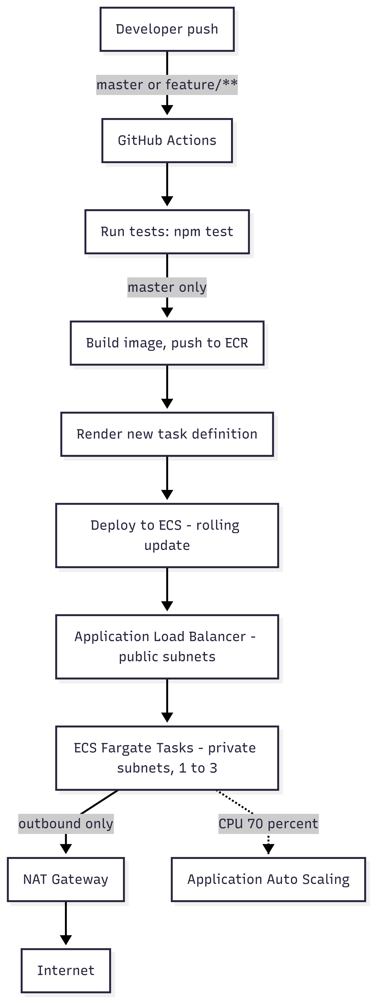

# Golden Owl DevOps Internship - Technical Test

Node.js service deployed to **AWS ECS Fargate**, with CI/CD via **GitHub Actions** and infrastructure in **Terraform**.

## Live deployment

```text
http://goldenowl-dev-alb-1580420975.ap-southeast-1.elb.amazonaws.com
```

```bash
curl http://goldenowl-dev-alb-1580420975.ap-southeast-1.elb.amazonaws.com
# {"message":"Welcome warriors to Golden Owl!"}
```

## Architecture

<p align="center"></p>
Feature branches run tests only. Only `master` triggers build and deploy.

## Docker

`src/Dockerfile` builds on `node:20-alpine` for a small image footprint. Dependencies are installed with `npm ci --omit=dev` so devDependencies (jest, eslint, supertest) never ship in the runtime image. The container exposes port 3000 and runs `node index.js` directly, no process manager needed since ECS handles restarts and scaling.

## CI/CD pipeline

| Stage | Trigger | What happens |
|---|---|---|
| `test` | Push/PR touching `src/**`, any branch | `npm ci` + `npm test` |
| `build-and-deploy` | Push to `master`, or manual `workflow_dispatch` | Build image, push to ECR, render new task definition, deploy to ECS, wait for stability |

Authenticates to AWS via **OIDC** - no static access keys stored in GitHub. The IAM role is scoped to ECR push and ECS deploy only.

## Infrastructure

Terraform, fully parameterized (no hardcoded values), modular (loosely coupled via outputs), backend config isolated to root only.

| Resource | Purpose |
|---|---|
| VPC + 2 public subnets (2 AZs) | Hosts the ALB, internet-facing |
| VPC + 2 private subnets (2 AZs) | Hosts ECS tasks, no direct inbound internet access |
| NAT Gateway | Lets private-subnet tasks pull images from ECR and reach the internet outbound |
| Amazon ECR | Container image registry |
| ECS Fargate cluster + service | Runs the application |
| Application Load Balancer | Public entry point, health checks |
| Application Auto Scaling | 1-3 tasks, 70% CPU target |
| IAM roles | Least-privilege ECS execution/task roles |

## Running locally

```bash
cd src
npm i
npm test
npm start
```

```bash
curl localhost:3000
# {"message":"Welcome warriors to Golden Owl!"}
```

## Deploying from scratch

End-to-end steps, in order, from an empty AWS account to a working deployment.

### Prerequisites

- AWS CLI configured with sufficient IAM permissions
- Terraform >= 1.5.0
- Docker

### 1. Set up AWS credentials locally

```bash
aws configure --profile goldenowl
export AWS_PROFILE=goldenowl
aws sts get-caller-identity
```

### 2. One-time OIDC setup

Lets GitHub Actions assume an AWS role without static keys stored as secrets.

Get the current GitHub OIDC thumbprint:

```bash
echo | openssl s_client -servername token.actions.githubusercontent.com \
  -showcerts -connect token.actions.githubusercontent.com:443 2>/dev/null \
  | openssl x509 -fingerprint -sha1 -noout \
  | cut -d'=' -f2 | tr -d ':' | tr 'A-Z' 'a-z'
```

Register the provider:

```bash
aws iam create-open-id-connect-provider \
  --url https://token.actions.githubusercontent.com \
  --client-id-list sts.amazonaws.com \
  --thumbprint-list <thumbprint-from-above>
```

Create the IAM role (replace `<account-id>` and `<your-org/your-repo>`):

```bash
aws iam create-role --role-name goldenowl-github-actions \
  --assume-role-policy-document '{
    "Version": "2012-10-17",
    "Statement": [{
      "Effect": "Allow",
      "Principal": {
        "Federated": "arn:aws:iam::<account-id>:oidc-provider/token.actions.githubusercontent.com"
      },
      "Action": "sts:AssumeRoleWithWebIdentity",
      "Condition": {
        "StringEquals": { "token.actions.githubusercontent.com:aud": "sts.amazonaws.com" },
        "StringLike": { "token.actions.githubusercontent.com:sub": "repo:<your-org/your-repo>:*" }
      }
    }]
  }'
```

Attach permissions (ECR push + ECS deploy):

```bash
aws iam put-role-policy --role-name goldenowl-github-actions \
  --policy-name goldenowl-cicd-inline \
  --policy-document '{
    "Version": "2012-10-17",
    "Statement": [
      {
        "Effect": "Allow",
        "Action": [
          "ecr:GetAuthorizationToken", "ecr:BatchCheckLayerAvailability",
          "ecr:GetDownloadUrlForLayer", "ecr:BatchGetImage",
          "ecr:PutImage", "ecr:InitiateLayerUpload",
          "ecr:UploadLayerPart", "ecr:CompleteLayerUpload"
        ],
        "Resource": "*"
      },
      {
        "Effect": "Allow",
        "Action": [
          "ecs:UpdateService", "ecs:DescribeServices",
          "ecs:DescribeTaskDefinition", "ecs:RegisterTaskDefinition",
          "ecs:ListTasks", "ecs:DescribeTasks"
        ],
        "Resource": "*"
      },
      {
        "Effect": "Allow",
        "Action": "iam:PassRole",
        "Resource": "*",
        "Condition": { "StringEquals": { "iam:PassedToService": "ecs-tasks.amazonaws.com" } }
      }
    ]
  }'
```

Keep the role ARN - it's needed in step 5.

Note: this role and the OIDC provider are created by hand, not by Terraform. Terraform itself needs credentials to run, so the identity that bootstraps everything can't also be created by that same Terraform run without a chicken-and-egg problem. Foundational access (this role, the local IAM user used to run Terraform) is set up once, outside of code; the application infrastructure it manages (VPC, ECS, ALB, etc.) is what Terraform owns.

### 3. Configure Terraform variables

```bash
cd terraform
cp terraform.tfvars.example terraform.tfvars
# edit terraform.tfvars if needed
```

```hcl
aws_region            = "ap-southeast-1"
project_name          = "goldenowl"
environment           = "dev"
availability_zones    = ["ap-southeast-1a", "ap-southeast-1b"]
private_subnet_cidrs  = ["10.0.10.0/24", "10.0.11.0/24"]
container_port        = 3000
task_cpu               = 256
task_memory             = 512
desired_count           = 1
autoscaling_min         = 1
autoscaling_max         = 3
```

### 4. Provision the infrastructure

```bash
bash ../scripts/init.sh
```

This bootstraps the S3 backend + DynamoDB lock table, migrates state to S3, then applies the VPC, ECR, ALB, ECS cluster/service, and autoscaling policy. Takes a few minutes, mostly waiting on the NAT Gateway and ECS service to stabilize. The script is idempotent - re-running it after the backend is already migrated just re-applies.

At this point the ECS service is running with a `nginx:latest` placeholder image (no real app image exists yet). This is expected: the ALB health check targets port 3000 while nginx listens on port 80, so it fails health checks and ECS retries once or twice before step 6 fixes it with the real image.

```bash
terraform output
```

Save `ecr_repository_url`, `ecs_cluster_name`, `ecs_service_name` for the next step.

### 5. Configure GitHub repository secrets and variables

Under **Settings > Secrets and variables > Actions**:

- Secret `AWS_ROLE_ARN` - the role ARN from step 2
- Secret `AWS_REGION` - e.g. `ap-southeast-1`
- Variable `ECR_REPOSITORY`, `ECS_CLUSTER`, `ECS_SERVICE`, `ECS_CONTAINER_NAME` - from `terraform output` in step 4

### 6. Trigger the first deployment

```bash
git push origin master
```

Or run `workflow_dispatch` from the Actions tab. Watch it run under **Actions**: `test` runs first, then `build-and-deploy` builds the image, pushes to ECR, and deploys to ECS. This replaces the nginx placeholder with the real app - once it does, the ALB health check starts passing within one check cycle.

### 7. Verify

```bash
curl http://$(terraform output -raw app_url | sed 's|http://||')
# {"message":"Welcome warriors to Golden Owl!"}
```

## Tearing down

```bash
cd terraform
terraform destroy
```

Since the S3 backend bucket is itself managed by Terraform (`module.bootstrap`), destroying it too requires a couple of extra steps - Terraform keeps writing state into the bucket during the destroy above, so new object versions can appear after you've already tried to empty it. Repeat the empty-and-destroy step until the bucket is confirmed empty:

```bash
BUCKET="<project>-<environment>-tfstate"

aws s3api delete-objects --bucket "$BUCKET" \
  --delete "$(aws s3api list-object-versions --bucket "$BUCKET" \
  --query '{Objects: Versions[].{Key:Key,VersionId:VersionId}}' --output json)" 2>/dev/null

aws s3api delete-objects --bucket "$BUCKET" \
  --delete "$(aws s3api list-object-versions --bucket "$BUCKET" \
  --query '{Objects: DeleteMarkers[].{Key:Key,VersionId:VersionId}}' --output json)" 2>/dev/null

aws s3api list-object-versions --bucket "$BUCKET" --output json
```

Once that command returns no `Versions` or `DeleteMarkers`, finish tearing down:

```bash
terraform destroy -target=module.bootstrap -lock=false
aws s3api delete-bucket --bucket "$BUCKET" --region <region>
```


## Design decisions & trade-offs

**Private subnets for ECS tasks.** Tasks run in private subnets with no public IP; only the ALB sits in public subnets. A NAT Gateway gives tasks outbound access to pull images from ECR and ship logs to CloudWatch. This is closer to a real production setup than putting everything in public subnets.

**Health check grace period.** `health_check_grace_period_seconds` gives new tasks a window before the ALB starts health-checking them, so a slow-starting container isn't killed before it's ready. Kept short here since this app has no external dependencies (no DB connection, etc.) to wait on.

**Single NAT Gateway.** One NAT Gateway shared across both private subnets, not one per AZ. Cheaper, with a single point of failure for outbound traffic - acceptable for a dev/test environment, not for production.

**If this were real production, I would change:**
- One NAT Gateway per AZ, for outbound-traffic high availability
- Enable Container Insights on the ECS cluster (currently disabled to reduce cost)
- Multiple environments (staging/prod) via separate `.tfvars` and workspaces, not just `dev`
- HTTPS on the ALB via ACM certificate + Route 53 domain, instead of plain HTTP
- Secrets (if any were needed) via AWS Secrets Manager or SSM Parameter Store, not environment variables
- CloudWatch alarms on ECS/ALB metrics with SNS notifications
- A non-default `desired_count` and `autoscaling_min` greater than 1, so a single AZ failure doesn't drop the service to zero tasks
- The GitHub OIDC role and provider provisioned through Terraform as well, managed by a separate bootstrap identity outside this repo, instead of created by hand

## Repository layout

```text
.github/workflows/ci-cd.yml   - CI/CD pipeline
src/                           - Node.js app + Dockerfile
terraform/
  main.tf                      - Root module, wires other modules
  bootstrap.tf                  - Bootstrap module (run once)
  backend.tf.disabled           - S3 backend config (enabled by init.sh)
  terraform.tfvars.example      - Template for environment-specific values
  modules/
    bootstrap/                   - S3 bucket + DynamoDB lock table
    networking/                  - VPC, public/private subnets, NAT, route tables
    ecr/                         - Container image repository
    iam/                         - ECS execution and task roles
    alb/                         - Load balancer, target group, listener
    ecs/                         - Cluster, task definition, service
    autoscaling/                  - CPU-based auto scaling policy
scripts/init.sh                 - Bootstrap + backend migration automation
```

## Bonus features

- **Load balancer** - ALB in front of ECS, health-checked on the app's actual port
- **Auto scaling** - CPU-based, 1-3 tasks
