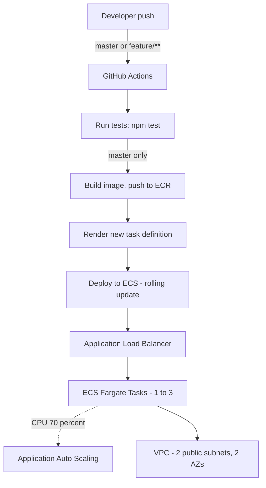

# Golden Owl DevOps Internship - Technical Test

Node.js service deployed to **AWS ECS Fargate**, with CI/CD via **GitHub Actions** and infrastructure in **Terraform**.

## Live deployment

```text
http://goldenowl-dev-alb-1183085817.ap-southeast-1.elb.amazonaws.com
```

```bash
curl http://goldenowl-dev-alb-1183085817.ap-southeast-1.elb.amazonaws.com
# {"message":"Welcome warriors to Golden Owl!"}
```

## Architecture



Feature branches run tests only. Only `master` triggers build and deploy.

## Repository layout

```text
.github/workflows/ci-cd.yml   - CI/CD pipeline
src/                           - Node.js app + Dockerfile
terraform/
  main.tf                      - Root module, wires other modules
  bootstrap.tf                  - Bootstrap module (run once)
  backend.tf.disabled           - S3 backend config (enabled by init.sh)
  terraform.tfvars              - Environment-specific values
  modules/
    bootstrap/                   - S3 bucket + DynamoDB lock table
    networking/                  - VPC, subnets, IGW, route tables
    ecr/                         - Container image repository
    iam/                         - ECS execution and task roles
    alb/                         - Load balancer, target group, listener
    ecs/                         - Cluster, task definition, service
    autoscaling/                  - CPU-based auto scaling policy
scripts/init.sh                 - Bootstrap + backend migration automation
```

## CI/CD pipeline

| Stage | Trigger | What happens |
|---|---|---|
| `test` | Push/PR touching `src/**`, any branch | `npm ci` + `npm test` |
| `build-and-deploy` | Push to `master`, or manual `workflow_dispatch` | Build image, push to ECR, render new task definition, deploy to ECS, wait for stability |

Authenticates to AWS via **OIDC** - no static access keys stored in GitHub. The IAM role is scoped to ECR push and ECS deploy only.

## Infrastructure

Terraform, fully parameterized (no hardcoded values), modular (loosely coupled via outputs), backend config isolated to root only.

| Resource | Purpose |
|---|---|
| VPC + 2 public subnets (2 AZs) | Network isolation, availability |
| Amazon ECR | Container image registry |
| ECS Fargate cluster + service | Runs the application |
| Application Load Balancer | Public entry point, health checks |
| Application Auto Scaling | 1-3 tasks, 70% CPU target |
| IAM roles | Least-privilege ECS execution/task roles |

## Running locally

```bash
cd src
npm i
npm test
npm start
```

```bash
curl localhost:3000
# {"message":"Welcome warriors to Golden Owl!"}
```

## Deploying from scratch

### Prerequisites

- AWS CLI configured with sufficient IAM permissions
- Terraform >= 1.5.0
- Docker

### 1. OIDC setup (one-time, lets GitHub Actions assume an AWS role)

Get the current GitHub OIDC thumbprint:

```bash
echo | openssl s_client -servername token.actions.githubusercontent.com \
  -showcerts -connect token.actions.githubusercontent.com:443 2>/dev/null \
  | openssl x509 -fingerprint -sha1 -noout \
  | cut -d'=' -f2 | tr -d ':' | tr 'A-Z' 'a-z'
```

Register the provider:

```bash
aws iam create-open-id-connect-provider \
  --url https://token.actions.githubusercontent.com \
  --client-id-list sts.amazonaws.com \
  --thumbprint-list <thumbprint-from-above>
```

Create the IAM role (replace `<account-id>` and `<your-org/your-repo>`):

```bash
aws iam create-role --role-name goldenowl-github-actions \
  --assume-role-policy-document '{
    "Version": "2012-10-17",
    "Statement": [{
      "Effect": "Allow",
      "Principal": {
        "Federated": "arn:aws:iam::<account-id>:oidc-provider/token.actions.githubusercontent.com"
      },
      "Action": "sts:AssumeRoleWithWebIdentity",
      "Condition": {
        "StringEquals": { "token.actions.githubusercontent.com:aud": "sts.amazonaws.com" },
        "StringLike": { "token.actions.githubusercontent.com:sub": "repo:<your-org/your-repo>:*" }
      }
    }]
  }'
```

Attach permissions (ECR push + ECS deploy):

```bash
aws iam put-role-policy --role-name goldenowl-github-actions \
  --policy-name goldenowl-cicd-inline \
  --policy-document '{
    "Version": "2012-10-17",
    "Statement": [
      {
        "Effect": "Allow",
        "Action": [
          "ecr:GetAuthorizationToken", "ecr:BatchCheckLayerAvailability",
          "ecr:GetDownloadUrlForLayer", "ecr:BatchGetImage",
          "ecr:PutImage", "ecr:InitiateLayerUpload",
          "ecr:UploadLayerPart", "ecr:CompleteLayerUpload"
        ],
        "Resource": "*"
      },
      {
        "Effect": "Allow",
        "Action": [
          "ecs:UpdateService", "ecs:DescribeServices",
          "ecs:DescribeTaskDefinition", "ecs:RegisterTaskDefinition",
          "ecs:ListTasks", "ecs:DescribeTasks"
        ],
        "Resource": "*"
      },
      {
        "Effect": "Allow",
        "Action": "iam:PassRole",
        "Resource": "*",
        "Condition": { "StringEquals": { "iam:PassedToService": "ecs-tasks.amazonaws.com" } }
      }
    ]
  }'
```

### 2. Configure `terraform.tfvars`

```hcl
aws_region         = "ap-southeast-1"
project_name       = "goldenowl"
environment        = "dev"
availability_zones = ["ap-southeast-1a", "ap-southeast-1b"]
container_port     = 3000
task_cpu           = 256
task_memory        = 512
desired_count      = 1
autoscaling_min    = 1
autoscaling_max    = 3
```

### 3. Provision infrastructure

```bash
cd terraform
bash ../scripts/init.sh
terraform output
```

### 4. Configure GitHub

Set under **Settings > Secrets and variables > Actions**.

**Secrets:** `AWS_ROLE_ARN` (role ARN from step 1), `AWS_REGION`

**Variables:** `ECR_REPOSITORY`, `ECS_CLUSTER`, `ECS_SERVICE`, `ECS_CONTAINER_NAME` - all from `terraform output`.

### 5. Trigger first deployment

Push to `master`, or run `workflow_dispatch` from the Actions tab.

## Bonus features

- **Load balancer** - ALB in front of ECS, health-checked on the app's actual port
- **Auto scaling** - CPU-based, 1-3 tasks
